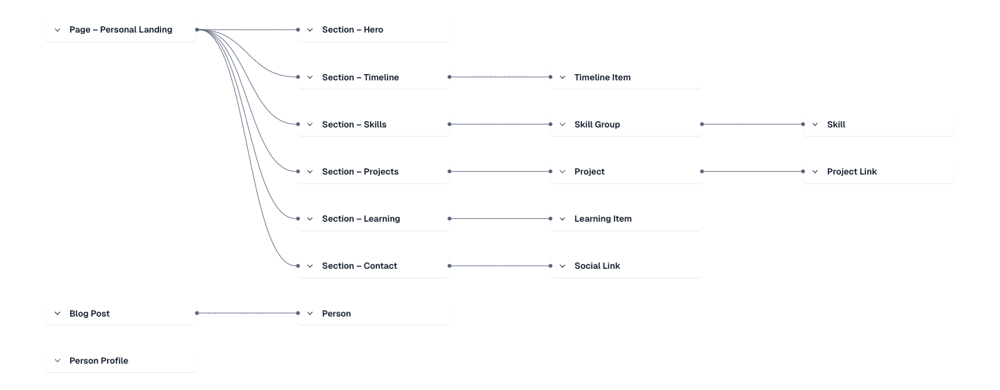

# ⚠️ Under Construction - Base Personal Site

Buffering...

## narrative-interface-system

Narrative Interface System is the evolution of my personal landing page codebase into a reusable, section-driven foundation. It keeps the proven landing experience intact today while treating every section (hero, timeline, skills, projects, learning, contact) as a composable building block.

This repo is where I harden the data contracts, layout shell, and Contentful mapping patterns that will power future narrative surfaces. The current deployment still serves the personal site, but each change aims to make the same system ready for additional pages without rewriting the core.

[](./VERSION)  
[](https://github.com/gah-code/narrative-interface-system/commits/main)  
[](https://nodejs.org/)  
[](https://app.netlify.com/projects/narrative-interface-system/deploys)

> **Narrative Interface System** is a high-signal personal landing page that treats SEO, narrative, and content modeling as one system.  
> Built UI-first, CMS-second, with **Contentful** + **Agent-assisted reviews** to keep the landing page sharp.

Structure version: `v0.1.0`  
See [`VERSION`](./VERSION) and [`CHANGELOG.md`](./CHANGELOG.md) for history.



---

## Table of Contents

1. [Project Goals](#1-project-goals)  
2. [Status & Metrics](#2-status--metrics)  
3. [Tech Stack](#3-tech-stack)  
4. [Architecture & Folder Structure](#4-architecture--folder-structure)  
5. [Data & Agent Flow](#5-data--agent-flow)  
6. [Getting Started](#6-getting-started)  
7. [Development Scripts](#7-development-scripts)  
8. [Phases (0–9)](#8-phases-0–9)  
9. [Next Steps – Landing Page To-Dos](#9-next-steps--landing-page-to-dos)  
10. [AgentOps Workflow](#10-agentops-workflow)  
11. [Deployment (Netlify)](#11-deployment-netlify)

---

## 1. Project Goals

**Core focus: a strong landing page**

- Build a **single-page personal landing** that:
  - Reads clearly for **recruiters, hiring managers, collaborators**.
  - Shows **SEO sense, content thinking, and frontend craft**.
- Treat the page as an **Interface & Narrative Toolkit**:
  - Clear positioning, key projects, and “Now / Learning” sections that tell a coherent story.

**SEO & Content**

- Go beyond “SEO is configured” into **SEO that actually sells you**:
  - Good headings, clear copy, structured data, and compelling social previews.
- Use **Contentful** to keep copy and sections flexible:
  - One bucket (Bucket 1 – Personal Landing) for this repo.
  - Other buckets (Blog/Notes, Projects index, etc.) live in other repos/docs.

**Agents**

- Use **Agent Checkpoints** to:
  - Review structure, copy, SEO, and UX.
  - Capture decisions in `agent/CHECKPOINT_LOG.md` for traceability.

---

## 2. Status & Metrics

- **Structure version:** `v0.1.0`
- **Changelog:** [`CHANGELOG.md`](./CHANGELOG.md)

**Latest Lighthouse (Netlify plugin):**

- Performance: **99**
- Accessibility: **96**
- Best Practices: **100**
- SEO: **100**
- PWA: **30** (PWA is explicitly not a goal for this project)

**Phase status (Bucket 1 – Personal Landing):**

- Phases **0–9**: ✅ **complete**

This repo is now “Phase 9 complete” – a solid, tested, deployed landing page.  
Everything under “Next Steps” is **optional polish** to keep sharpening the same page.

---

## 3. Tech Stack

### Core

- **Vite + React** (SPA)
- **TypeScript**
- **CSS with design tokens**
  - `tokens.css` – colors, typography, spacing, radii.
  - `layout.css` – layout, sections, header, responsive behavior.

### Content & Modeling

- **Contentful** (e.g. `master` environment)
  - Content model for Bucket 1 lives in sibling repo: `gharo-content-models`.
  - This app reads a single `pagePersonalLanding` entry with:
    - `slug: "/"`,
    - ordered `sections[]` referencing:
      - `sectionHero`, `sectionTimeline`, `sectionSkills`,
      - `sectionProjects`, `sectionLearning`, `sectionContact`.
- **Static TS fallback**
  - `personalLandingPage` object matches the Contentful-backed TS types.
  - Used as a typed fallback when CMS fetch fails or for local development.

### SEO

- `Seo.tsx` – manages `<title>` + `<meta name="description">` for SPA.
- `PersonSchema.tsx` – JSON-LD Person schema for personal-brand queries.

### Agents

- **AgentOps loop**
  - Checkpoint prompts + payloads in `agent/checkpoints/`.
  - Helper: `agent/scripts/buildCheckpointPayload.mjs`.
- Used to review:
  - Data modeling, mapping, SEO choices, UX, and layout.

### Deploy & Quality

- **Netlify**
  - Build: `npm run build`
  - Publish: `dist`
- **Env vars**
  - `VITE_CONTENTFUL_SPACE_ID`
  - `VITE_CONTENTFUL_ENVIRONMENT`
  - `VITE_CONTENTFUL_DELIVERY_TOKEN`
  - `SECRETS_SCAN_OMIT_KEYS`
- **Lighthouse CI**
  - `@netlify/plugin-lighthouse` via `netlify.toml`.

---

## 4. Architecture & Folder Structure

```text
narrative-interface-system/
├── VERSION
├── README.md
├── CHANGELOG.md
├── package.json
├── tsconfig.json
├── .eslintrc.cjs
├── .prettierrc
├── .gitignore
├── .env.example             # template for Contentful env vars (no secrets)
├── .nvmrc                   # Node version hint for CI/Netlify
├── netlify.toml             # Netlify build + Lighthouse plugin config
├── agent/
│   ├── CHECKPOINT_LOG.md    # log of agent checkpoints + decisions
│   ├── checkpoints/         # markdown payloads/prompts per phase
│   └── scripts/
│       └── buildCheckpointPayload.mjs
├── src/
│   ├── main.tsx             # Vite entrypoint, mounts <App />
│   ├── App.tsx              # wraps the Page component
│   ├── data/
│   │   └── page-personal-landing.ts
│   ├── services/
│   │   ├── contentfulClient.ts
│   │   └── fetchPersonalLandingPage.ts
│   ├── components/
│   │   ├── layout/
│   │   │   └── Page.tsx
│   │   ├── sections/
│   │   │   ├── SectionRenderer.tsx
│   │   │   ├── HeroSection.tsx
│   │   │   ├── TimelineSection.tsx
│   │   │   ├── SkillsSection.tsx
│   │   │   ├── ProjectsSection.tsx
│   │   │   ├── LearningSection.tsx
│   │   │   └── ContactSection.tsx
│   │   ├── Seo.tsx
│   │   └── PersonSchema.tsx
│   ├── styles/
│   │   ├── tokens.css
│   │   └── layout.css
│   └── __tests__/           # or co-located *.test.ts files
└── public/
    # static assets (favicons, etc.) – optional
````

---

## 5. Data & Agent Flow

### 5.1 CMS → Typed Data

- `contentfulClient.ts`:

  - Uses `VITE_CONTENTFUL_*` env vars to create a CDA client.
- `fetchPersonalLandingPage.ts`:

  - Fetches `pagePersonalLanding` with `slug: "/"`.
  - Uses `include` depth to pull in all linked sections/items.
  - Maps into:

    - `PersonalLandingPage`
    - Section types (`HeroSection`, `TimelineSection`, `SkillsSection`, `ProjectsSection`, `LearningSection`, `ContactSection`).
  - Uses:

    - Section mapper registry (`contentTypeId` → mapper).
    - Safe array helpers and defensive defaults.
    - Unknown section types are logged and skipped instead of crashing.

### 5.2 Typed Data → UI

- `Page.tsx`:

  - Loads CMS data on mount; falls back to `personalLandingPage` on error.
  - Renders:

    - Skip link, sticky header, nav, and all sections via `SectionRenderer`.
    - `<Seo />` + `<PersonSchema />` for SEO and structured data.
- `SectionRenderer.tsx`:

  - Switches on `section.sectionType` and renders the appropriate section component.

### 5.3 Agent Flow

- Use `agent:build` or checkpoint `.md` files to:

  - Bundle code + context for review.
  - Ask about SEO, layout, types, mapping, or narrative.
- Apply suggestions and log them in `agent/CHECKPOINT_LOG.md`.

---

## 6. Getting Started

### Prerequisites

- Node **18+** or **20+**
- npm

### Install dependencies

```bash
npm install
```

### Configure environment variables

```bash
cp .env.example .env.local
```

Then fill:

```env
VITE_CONTENTFUL_SPACE_ID=your_space_id
VITE_CONTENTFUL_ENVIRONMENT=master
VITE_CONTENTFUL_DELIVERY_TOKEN=your_delivery_token
```

### Run the dev server

```bash
npm run dev
```

Open `http://localhost:5173`.

### Production build & preview

```bash
npm run build
npm run preview
```

Open `http://localhost:4173`.

---

## 7. Development Scripts

```jsonc
"scripts": {
  "dev": "vite",
  "build": "vite build",
  "preview": "vite preview",
  "lint": "eslint \"src/**/*.{ts,tsx}\"",
  "format": "prettier --write \"src/**/*.{ts,tsx,css,md}\"",
  "test": "vitest",
  "test:watch": "vitest --watch",
  "agent:build": "node agent/scripts/buildCheckpointPayload.mjs"
}
```

- `npm run dev` – dev server.
- `npm run build` – production build.
- `npm run preview` – preview built site.
- `npm run lint` – ESLint.
- `npm run format` – Prettier.
- `npm run test` / `test:watch` – tests (mappers, components).
- `npm run agent:build` – build an Agent checkpoint payload.

---

## 8. Phases (0–9)

All **complete** for Bucket 1 – Personal Landing:

- **Phase 0 – Setup** – scaffold, tooling, Agent skeleton.
- **Phase 1 – Static Data Shape** – TS types + static `personalLandingPage`.
- **Phase 2 – Layout** – `Page.tsx`, `SectionRenderer`, sections.
- **Phase 3 – Visual Design & Tokens** – tokens + layout CSS.
- **Phase 4 – UX & Accessibility** – skip link, focus, headings, sticky nav.
- **Phase 5 – Contentful Model** – Bucket 1 model in `gharo-content-models`.
- **Phase 6 – Seed Content** – real data in Contentful.
- **Phase 7 – Integration & Mapping** – CMS → TS mapping, safe patterns.
- **Phase 8 – Go Live + SEO / Lighthouse** – Netlify deploy, plugin, SPA SEO basics.
- **Phase 9 – Hardening & Beyond** – JSON-LD Person, Vitest, CI workflow (lint + test + build).

From here on out, changes are incremental polish on this **one landing page**.

---

## 9. Next Steps – Landing Page To-Dos

Phase 9 – Hardening & Beyond is complete for this repo. The landing page is live, tested, mapped to Contentful, and has solid SEO basics. Ongoing tasks now live in `TASKS.md`.

## 11. Deployment (Netlify)

### Link site (CLI)

```bash
netlify login
netlify link    # choose your Netlify site (e.g. narrative-interface-system)
```

### Set environment variables (CLI)

```bash
netlify env:set VITE_CONTENTFUL_SPACE_ID your_space_id
netlify env:set VITE_CONTENTFUL_ENVIRONMENT master
netlify env:set VITE_CONTENTFUL_DELIVERY_TOKEN your_delivery_token

# Ignore non-sensitive space ID in secrets scan
netlify env:set SECRETS_SCAN_OMIT_KEYS VITE_CONTENTFUL_SPACE_ID
```

### Deploy

```bash
npm run build
netlify deploy --prod
# Build command: npm run build
# Publish directory: dist
```
